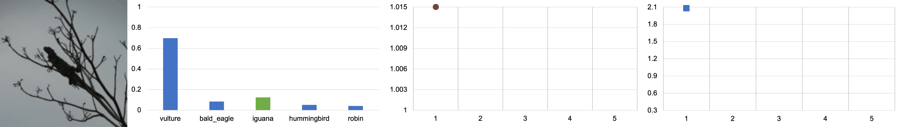

<div align="center">

<!-- TITLE -->
# **Test-time Adaptation of Discriminative Models via Diffusion Generative Feedback**

<!-- []() -->
[](https://diffusion-tta.github.io)
</div>

This is the official implementation of the paper [Test-time Adaptation with Diffusion Models]() by Mihir Prabhudesai, Tsung-Wei Ke, Alexander Li, Deepak Pathak, and Katerina Fragkiadaki.
<!-- DESCRIPTION -->

## Abstract

The advancements in generative modeling, particularly the advent of diffusion models, have sparked a fundamental question: how can these models be effectively used for discriminative tasks? In this work, we find that generative models can be great test-time adapters for discriminative models. Our method, Diffusion-TTA, adapts pre-trained discriminative models such as image classifiers, segmenters and depth predictors, to each unlabelled example in the test set using generative feedback from a diffusion model.

We achieve this by modulating the conditioning of the diffusion model using the output of the discriminative model. We then maximize the image likelihood objective by backpropagating the gradients to discriminative model’s parameters. We show Diffusion-TTA significantly enhances the accuracy of various large-scale pre-trained discriminative models, such as, ImageNet classifiers, CLIP models, image pixel labellers and image depth predictors. Diffusion-TTA outperforms existing test-time adaptation methods, including TTT-MAE and TENT, and particularly shines in online adaptation setups, where the discriminative model is continually adapted to each example in the test set.


## Diffusion-TTA


**Generative diffusion models are great test-time adapters for discriminative models.** Our method consists of discriminative and generative modules. Given an image $x$, the discriminative model $f_{\theta}$ predicts task output $y$. The task output $y$ is transformed into condition $c$. Finally, we use the generative diffusion model $\epsilon_{\phi}$ to measure the likelihood of the input image, conditioned on $c$. This consists of using the diffusion model $\epsilon_{\phi}$ to predict the added noise $\epsilon$ from the noisy image $x_t$ and condition $c$. We maximize the image likelihood using the diffusion loss by updating the discriminative and generative model weights via backpropagation. 





Our model improves classification test performance without the need of ground-truth labels. Classification errorr are corrected by minimizing the diffusion loss.

## Installation 
Create a conda environment with the following command:
```bash
conda update conda
conda env create -f environment.yml
conda activate diff_tta
```

### Prepare DiT
Clone our DiT branch forked from the official repo.  We adapt the original code so that we vary the class text embeddings.
```
git clone https://github.com/mihirp1998/DiT.git
mv DiT diff_tta/models
mkdir pretrained_models
```

## Commands to Get Started
Our classification results vary with the randomly sampled noises and timesteps during TTA.  To reproduce our results, we provide the commands used in each experiment. See [Getting_Startted.md](./GETTING_STARTED.md) for details.


## Citation

If you find this work useful in your research, please cite:

```bibtex
@inproceedings{prabhudesai2023difftta,
      title={Test-time Adaptation of Discriminative Models via Diffusion Generative Feedback},
      author={Prabhudesai, Mihir and Ke, Tsung-Wei and Li, Alexander C. and Pathak, Deepak and Fragkiadaki, Katerina},
      year={2023},
      booktitle={Conference on Neural Information Processing Systems},
}
```

## License
This code base is released under the MIT License (refer to the LICENSE file for details).
